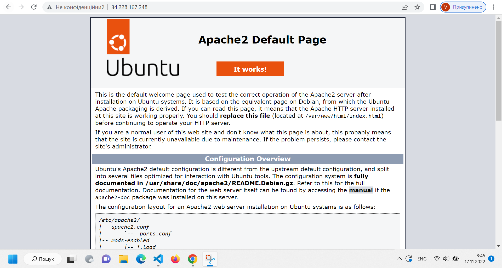
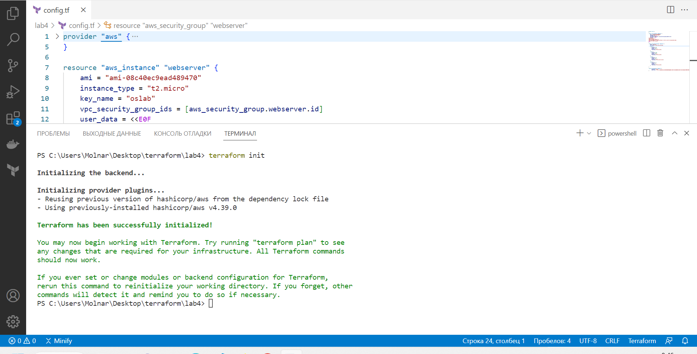

# LAB3
# Молнар Василь Васильович ІПЗ-2.1
Хід роботи
План роботи
1.	Використання готових Docker Images.
2.	Використання Docker Compose.
3.	Створення HTML сторінки та занесення її в Docker Image. Залити даний Docker Image на Docker Hub.
4.	Скачати Docker Image когось із групи і розвернути в себе контейнер з HTML сторінкою на порті 8086 ззовні.

Хід роботи
1.	Використання готових Docker Images.
Створив файл dockercompose.yml і в нього добавив наступне

В терміналі виконав команду docker-compose up –d
Перехожу на localhost:8080 і бачу наступне

2.Використання Docker Compose.

Docker використовується для керування окремими контейнерами (сервісами), з яких складається програма.

Docker Compose інструмент конфігурації, що використовується для запуску декількох контейнерів одночасно.
Конфігурація цієї програми описується у файлі YAML. Запустити програму, яка раніше зібрана в контейнер, можна однією командою.

За допомогою Docker Compose можна перенести сайти за допомогою всього декількох команд. Потрібно лише змінити деякі налаштування та перенести на інший сервер резервну копію баз даних.
Компоненти каталогу:
-файл docker-compose.yml. У ньому зберігаються інструкції, які використовуються для запуску та подальшого налаштування сервісів.
-Каталог server. Тут зберігатимуться файли, відповідальні за функціонування сервера.
-Каталог client. У ньому розміщені файли для клієнт-програми.

3)Створення HTML сторінки та занесення її в Docker Image. Залити даний Docker Image на Docker Hub.
Для початку, створив нову папку, в якій створив Dockerfile і вніс в нього наступне:

Авторизувався на DockerHub та створив новий репозиторій lab
Створив html сторінку: 
Створюю образ lab
Docker build –t index .
Та запускаю його на порті docker run -t –rm -p 8081:80 index

4) Скачати Docker Image когось із групи і розвернути в себе контейнер з HTML сторінкою на порті 8086 ззовні.

Висновок: на даній лабораторній роботі я зміг попрацювати з докером, розвернути вордпрес, створити свій image.

