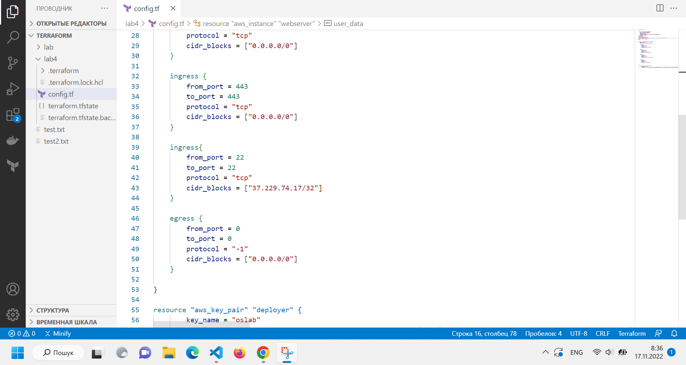

# LAB4
# Молнар Василь Васильович ІПЗ-2.1

1.Реєстрації на AWS
2.Встановити terraform
3.Створення config.tf файлу В нього я помістив ось такий код
4.Прописав terraform init та terraform apply
5.terraform destroy

Висновок: на даній лабораторній роботі я завдяки terraform зміг створити власний сервер.

