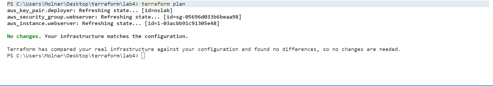
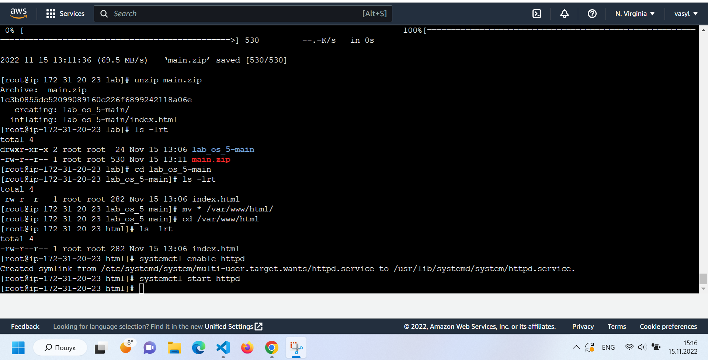

# LAB5
# Молнар Василь Васильович ІПЗ-2.1

Підключаюсь до інстансу EC2.
Переключаюсь на кореневого користувача та оновлюю систему.
Далі створюю папку lab, в неї завантажую проект з GitHub та розпаковую zip-файл з проектом.
Переношу розпаковані файли в папку веб-сервера.
Запускаю сервер.
Переходжу по Public IP-адресі, http://3.208.21.117/

